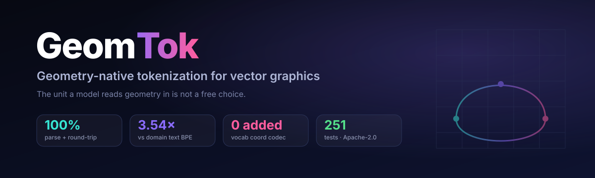
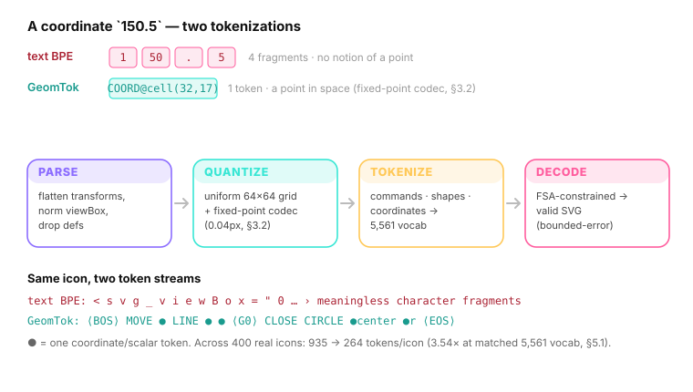
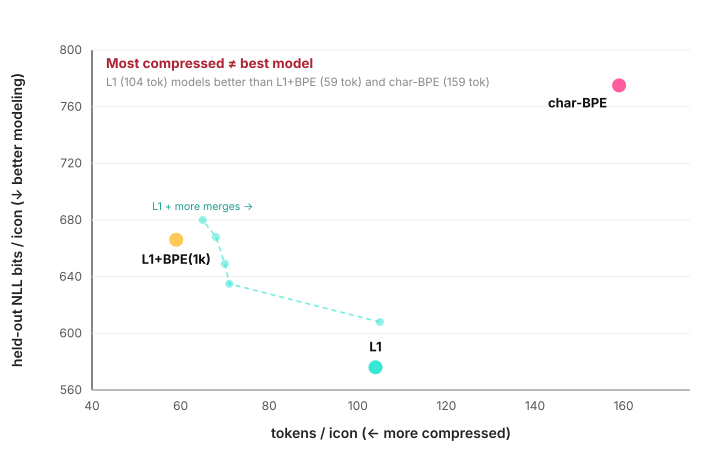
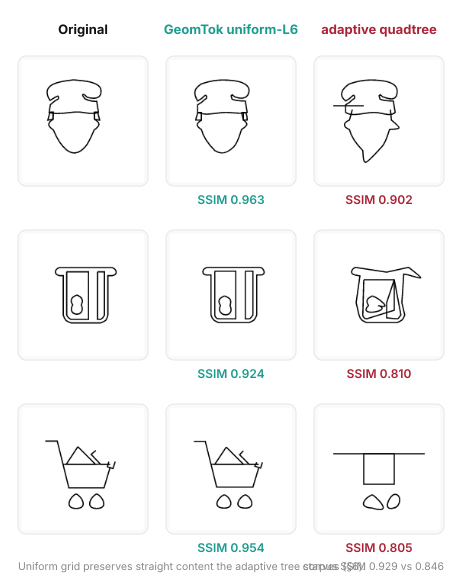

<p align="center">
  
</p>

<p align="center">
  <a href="LICENSE"></a>
  
  
  
  <a href="PAPER.md"></a>
  <a href="README.ko.md"></a>
</p>

---

## Why GeomTok

Language models tokenize vector graphics (SVG) the way they tokenize prose — they shred a coordinate like `150.5` into `1`, `50`, `.`, `5`, fragments that carry no notion of *a point in space*. **GeomTok** is a geometry-native tokenizer that maps SVG to a small vocabulary of primitive tokens (commands, shapes, and a zero-vocabulary fixed-point coordinate codec), so a model reads geometry as geometry.

It ships as a **torch-free, `numpy`-only OSS core** plus a managed FastAPI service, and a render-based evaluation protocol — **GeomTok-Eval** — that scores tokenizers, not generators.

<p align="center">
  
</p>

## The headline finding: compression ≠ modelability

Under a controlled tokenizer-swap on an identical small transformer (the only variable is the tokenizer), geometric primitive tokens model held-out icons **26% better** than a domain-trained text BPE — and, counter-intuitively, **better than the more-compressed learned-merge variant**. More compression does not reliably mean better downstream modeling.

<p align="center">
  
</p>

| Tokenizer (same 2.5M model, real icons) | tokens/icon | held-out NLL bits/icon ↓ |
|---|---|---|
| domain char-BPE | 159 | 775 ± 6 |
| GeomTok-L1 + learned BPE *(most compressed)* | 59 | 666 ± 2 |
| **GeomTok-L1** | 104 | **576 ± 4** |

The gap **holds and does not shrink** with model capacity (0.9M → 9.3M params; it widens then plateaus) and **replicates** on a second corpus. Full study, figures, and honest negative results: **[PAPER.md](PAPER.md)**.

## Round-trip fidelity is real, not lossless

GeomTok's coordinate codec is bounded-error (mean **1.78px**, max 3.37px on a 300px canvas), render **SSIM 0.929** — the honest cost of 3.54× compression. The error *tail* is now measured, not just the mean: on the bundled 2,726-icon validation corpus (92,840 coordinates), p50/p90/p99 = 2.36/3.25/**3.32px** — the tail is pinned at the uniform grid's quantization ceiling rather than spreading — **61.7%** of coordinates exceed the 2px perceptibility threshold (the honest cost of the 64×64 grid), and only **2 of 92,840** coordinates exceed the codec's error ceiling (3.4px): both caused by out-of-viewBox clamping, and both flagged by the tokenizer's own `clamped` warning (`.research/results_e6_error_tail.txt`). A curvature-adaptive grid we tried *warps straight content* and was retracted in favor of a plain uniform grid:

<p align="center">
  
</p>

## Quickstart

```bash
pip install geomtok                 # core (numpy only)
pip install 'geomtok[eval,server]'  # + render eval + managed API
```

```python
import geomtok

out = geomtok.tokenize("<svg viewBox='0 0 24 24'><path d='M4 4 L20 4 L20 20 Z'/></svg>")
print(out["n_tokens"], out["tokenizer_version"], out["vocab_id"])

svg = geomtok.detokenize(out["token_ids"],
                         tokenizer_version=out["tokenizer_version"],
                         vocab_id=out["vocab_id"])["svg"]   # FSA-valid SVG, guaranteed

# For model training/generation: lean L1 — same reconstruction, ~23% fewer tokens.
# (Continuity/curvature markers are derivable; keeping them costs ~12% held-out NLL.)
lean = geomtok.tokenize(svg, lean=True)
```

Run the managed API locally:

```bash
geomtok-serve --port 8000
```

| Route | What it does |
|---|---|
| `POST /v1/tokenize` · `/v1/detokenize` | single SVG ↔ tokens; deterministic, FSA-validated |
| `POST /v1/eval` | GeomTok-Eval render-based protocol (builtin or your remote tokenizer) |
| `POST /v1/batch` · `/v1/stream` | sync batch (≤1000, ≤32MB) · NDJSON streaming |
| `POST /v1/batch/jobs` · `GET`/`DELETE /v1/batch/jobs/{id}` | **real async** jobs — worker, live progress, cancel, webhooks |
| `GET /v1/vocab/{id}` · `/v1/healthz` | immutable manifest · health |

Endpoint-by-endpoint conformance and what is production vs single-node: **[API_STATUS.md](API_STATUS.md)**.

## What ships in v1.1

| Capability | Status |
|---|---|
| Parser · transform-flatten · viewBox-normalize · arc-flatten | ✅ OSS core |
| L1 geometric tokens + **zero-vocab scalar fixed-point coord codec** (0.04px) | ✅ OSS core |
| **Lean L1** (`lean=True`) — the paper-recommended marker-free substrate: ~23% shorter streams, byte-identical reconstruction (2,726/2,726 verified) | ✅ OSS core · **new in v1.1** |
| **L2 = learned BPE-on-L1 merges** (hand-crafted macros retired — 0% fire on real data) | ✅ OSS core |
| FSA grammar-constrained decoding (torch-free) — **valid SVG guaranteed** | ✅ OSS core |
| Immutable vocab manifest — bit-identical, offline encode/decode | ✅ OSS core |
| GeomTok-Eval/1.1 — render-SSIM, value-level coord error + **error-tail percentiles & >2px perceptible rate**, parse rate, token economy | ✅ OSS core · **v1.1** |
| Managed API (FastAPI): 9 routes incl. real async jobs + NDJSON stream — all tokenize paths accept `lean` | ✅ `[server]` |

> **Generation is an explicit non-goal for v1.x.** The current model is toy-scale (2.5M params, CPU, monochrome path icons). The tokenizer + evaluation are the production deliverables; generation is Phase 2 (funding-gated).

## What's distinctive

Verified against the 2024–2026 SVG-tokenization literature (HiVG, OmniSVG, LLM4SVG, StrokeNUWA, InternSVG, CNM, GeoBPE):

- **Controlled tokenizer-swap with held-out NLL on SVG** — no prior SVG work isolates the tokenizer on a held-constant backbone.
- **GeomTok-Eval: a generator-decoupled tokenizer protocol** — existing SVG benchmarks (VGBench, SVGenius, VectorGym, LOO) score *generators*, not tokenizers.
- **Learned unconstrained merges beat HiVG-style structure-constrained merges** (172 vs 236 tokens/icon at matched budget) — the direct head-to-head, unpublished elsewhere.
- **Zero-added-vocabulary scalar fixed-point codec** — HiVG adds 2,384 coordinate tokens, OmniSVG ~40k; GeomTok adds none.

The "compression ≠ modelability" relationship is established for *text* (PathPiece, EMNLP'24) and *raster images* (arXiv:2412.16326, NeurIPS'25); GeomTok is the **first vector-graphics instance**, and runs the opposite direction (more compression never reliably helps).

## Roadmap

- [x] **v1.0** — torch-free OSS core (FSA decode, vocab manifest, BPE-on-L1 L2), GeomTok-Eval, managed FastAPI service. *Validated on real icons: 100% parse + round-trip, FSA-valid, deterministic.*
- [x] **v1.1** — lean L1 shipped as a first-class mode (the §5.1 ablation, productized); GeomTok-Eval/1.1 error-tail metrics; renderer-absence honesty (`null`, not fake `0.0`).
- [ ] **Phase 2** — generation at scale (currently toy-scale; explicit non-goal for v1.x)
- [ ] **Phase 3** — Figma / Canva plugins

## Documentation

| | |
|---|---|
| [PAPER.md](PAPER.md) | Research paper (compression ≠ modelability) |
| [PRD.md](PRD.md) | v1.0 product requirements (OSS API + managed service) |
| [API_STATUS.md](API_STATUS.md) | Endpoint conformance & guarantees |
| [REPRO.md](REPRO.md) | Reproducibility appendix (env, data, seeds) |
| [RESEARCH_SUMMARY.md](RESEARCH_SUMMARY.md) | Milestone history |

## License

**Apache-2.0** — the core, the evaluation protocol, and the vocab manifest are fully open (no crippling). Revenue is from managed hosting, SLAs, and support, not from withholding the algorithm. See [LICENSE](LICENSE) and [NOTICE](NOTICE).

<p align="center"><sub>GeomTok — teaching models to see geometry as geometry.</sub></p>
